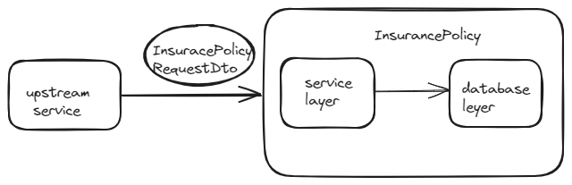

The components that are part of this code base are

    1. Input request and storage beans
    2. Service layer to process and validate the input read and write requests
    3. Database layer which contains the actual code to insert and update records in db

All the code is in core java. There is no web framework used.

The database that is decided to be used for this use case is Postgres
